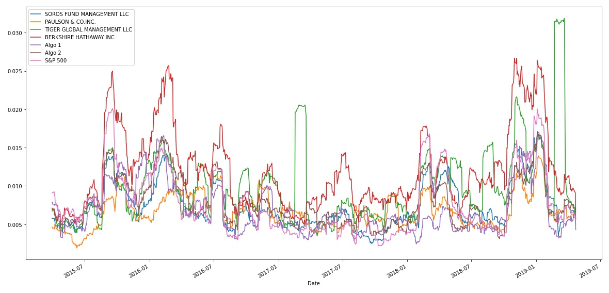
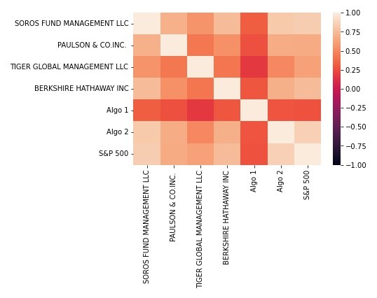
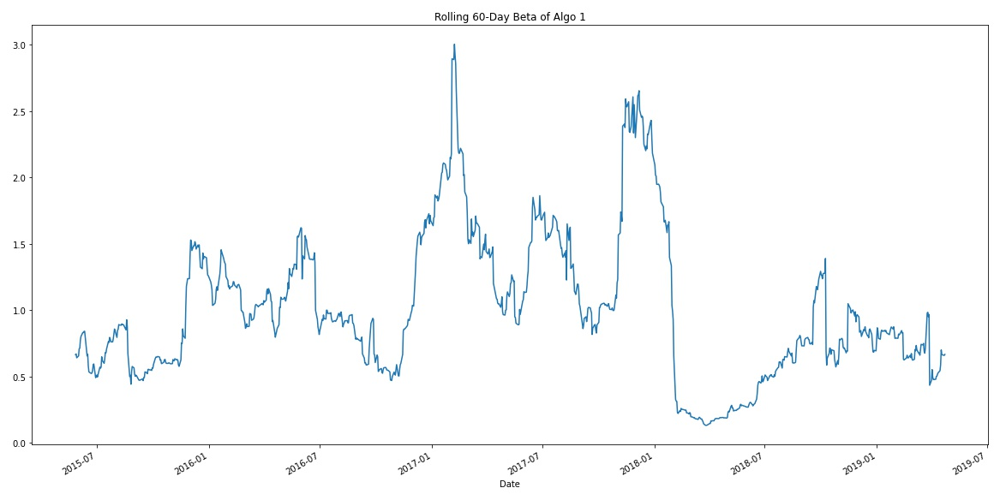
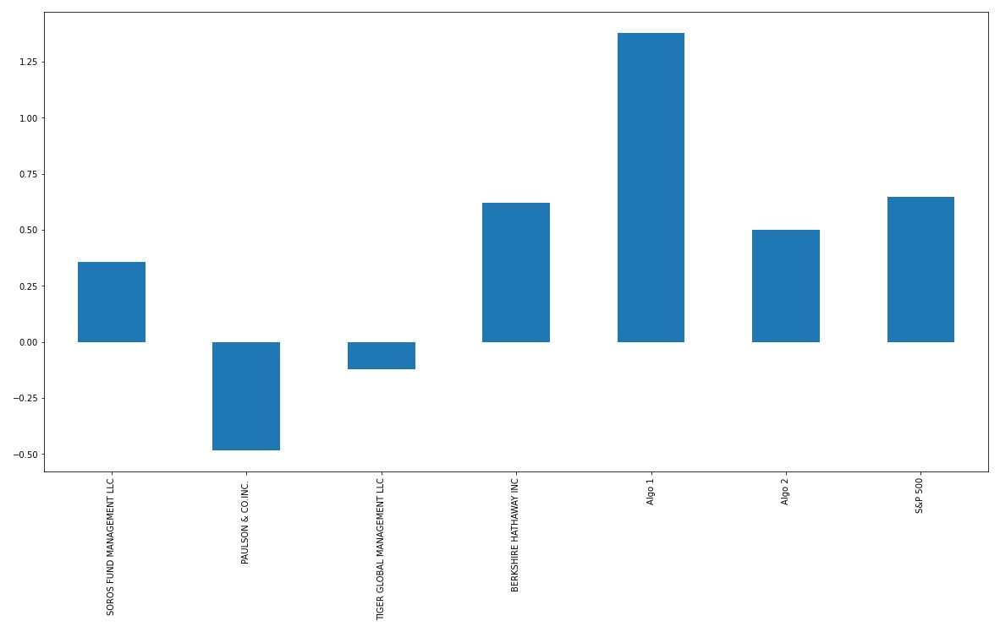

# Whale Analysis

Tool that analyzes and visualizes the major metrics of sample stock portfolios and determines the best-performer. Add a custom portfolio that you'd like to analyze against the others.

Source Code: [`whale_analysis.ipynb`](whale_analysis.ipynb)

# Required Datasets

Historical daily returns of several portfolios. The `.csv` files will require the following column data:

    | Symbol | Date | Closing Price |

# Sample Analysis

## Conduct Quantitative Analysis

Analyze the data to see if any of the portfolios outperform the stock market (i.e., the S&P 500).

## Performance Analysis

1. Calculate and plot daily returns of all sample portfolios.

    

2. Calculate and plot cumulative returns for all sample portfolios. Does any portfolio outperform the S&P 500?

    

## Risk Analysis

1. Create a box plot for each of the returns.

    

2. Calculate the standard deviation for each portfolio.

    ```
    BERKSHIRE HATHAWAY INC         0.012919
    TIGER GLOBAL MANAGEMENT LLC    0.010894
    S&P 500                        0.008554
    Algo 2                         0.008342
    SOROS FUND MANAGEMENT LLC      0.007895
    Algo 1                         0.007620
    PAULSON & CO.INC.              0.007023
    ```

3. Determine which portfolios are riskier than the S&P 500.

    ```
    SOROS FUND MANAGEMENT LLC is less risky than the S&P 500
    PAULSON & CO.INC.  is less risky than the S&P 500
    TIGER GLOBAL MANAGEMENT LLC is riskier than the S&P 500
    BERKSHIRE HATHAWAY INC is riskier than the S&P 500
    Algo 1 is less risky than the S&P 500
    Algo 2 is less risky than the S&P 500
    ```

4. Calculate the Annualized Standard Deviation.

    ```
    SOROS FUND MANAGEMENT LLC      0.125335
    PAULSON & CO.INC.              0.111488
    TIGER GLOBAL MANAGEMENT LLC    0.172936
    BERKSHIRE HATHAWAY INC         0.205077
    Algo 1                         0.120967
    Algo 2                         0.132430
    S&P 500                        0.135786
    ```

## Rolling Statistics

1. Calculate and plot the rolling standard deviation for all portfolios using a 21-day window.

    

2. Calculate and plot the correlation between each stock to determine which portfolios may mimick the S&P 500.

    

3. Choose one portfolio, then calculate and plot the 60-day rolling beta between it and the S&P 500.
    

## Rolling Statistics with Exponentially Weighted Average

An alternative method to calculate a rolling window is to take the exponentially weighted moving average. This is like a moving window average, but it assigns greater importance to more recent observations. Try calculating the [`ewm`](https://pandas.pydata.org/pandas-docs/stable/reference/api/pandas.DataFrame.ewm.html) with a 21-day half-life.

## Sharpe Ratios

1. Calculate and visualize the Sharpe ratios using a bar plot.
    

2. Determine whether the algorithmic strategies outperform both the market (S&P 500) and the whale portfolios.

    ```
    Based on risk to reward,
        - Algo 1 outperforms the S&P 500 and the whales portfolios.
        - Algo 2 outperforms most whales portfolios, except for the Berkshire Hathaway INC and the S&P500.
    ```

## Create a Custom Portfolio

1. Visit [Google Sheets](https://docs.google.com/spreadsheets/) and use the built-in Google Finance function to choose 3-5 stocks for your portfolio.

2. Download the data as CSV files and save in the `Resources` directory.

3. Run the Custom Portfolio Analysis Section.

# Useful Links 📝

* [`GOOGLEFINANCE` function help](https://support.google.com/docs/answer/3093281)